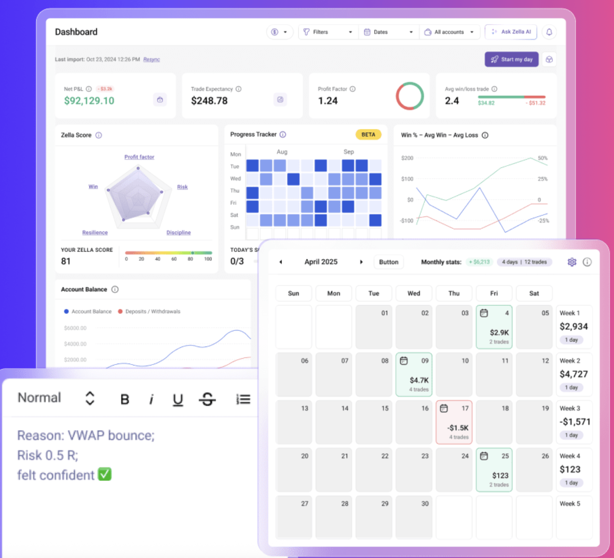
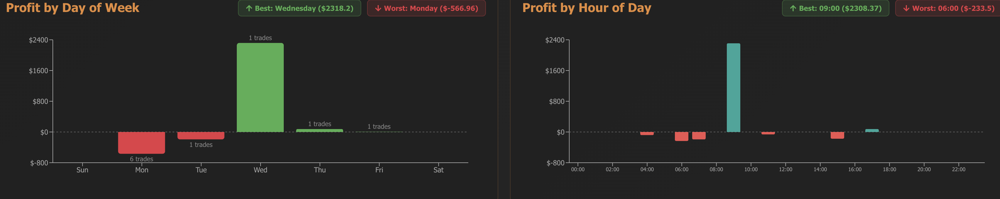
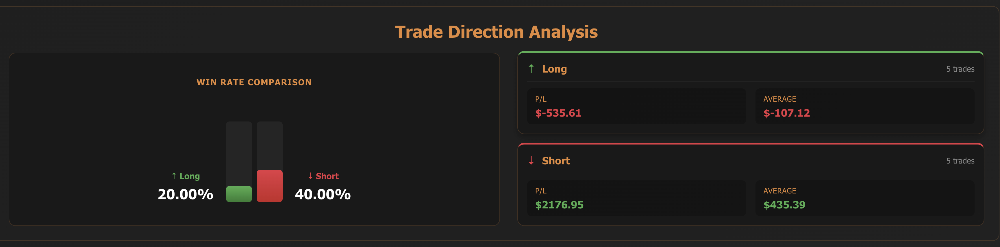
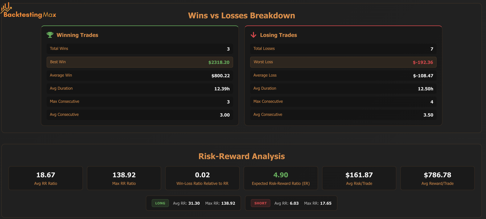
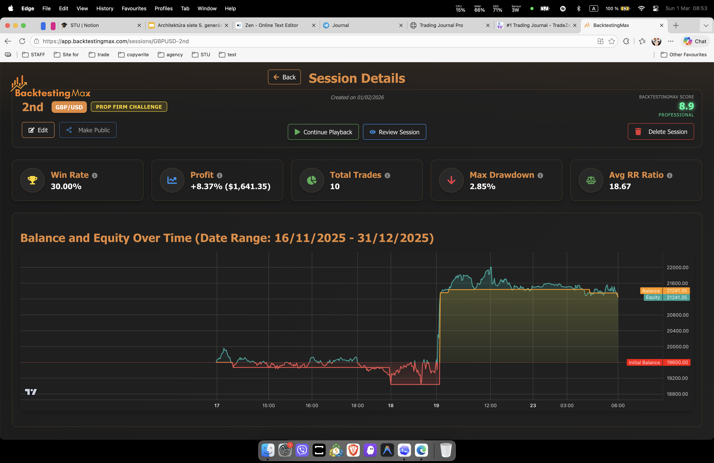
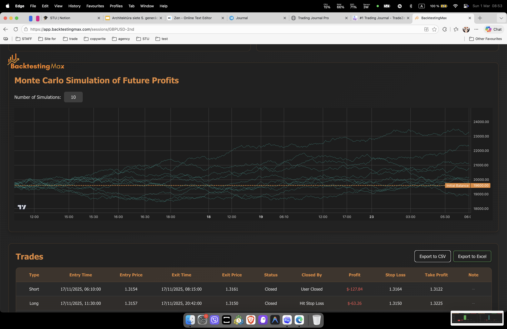

# Lingonberry Journal 🍒

> Simple Trading Journal for Prop Firm Traders - Log via Telegram, Analyze in Mini App

## Vision

Lingonberry Journal is a personal trading journal built for prop firm traders who want:

- **Quick logging** through Telegram chat (no forms, no friction)
- **Beautiful analytics** in a Telegram Mini App (multi-device, always accessible)
- **Proper chart context** with multi-timeframe views (4H, 30M, 5M)
- **Weekly review workflow** to compare actual trades vs "perfect" execution
- **BacktestingMax-inspired analytics** with visual depth

This is a personal tool first, not a SaaS. Built for my own trading, open-sourced for others.

## System Architecture

The trading system spans three applications:

| App | Port/Run | Purpose |
|-----|----------|---------|
| **trading-journal** (this) | `make run-web` → :5000 | Trade logging, dashboard, chart entry UI with drawing tools |
| **pine review** (`../pine/`) | `make review` → :8000 | Market structure analysis (ICT/SMC), backtesting, trade review |
| **vibe-trading** (`../vibe-trading/`) | CLI (`vibe-trading`) | Exchange connectors (Binance, Bybit, TradeLocker), execution |

### App Relationship

```
┌─────────────────┐     ┌──────────────────────┐
│ Trading Journal  │     │   Pine Review         │
│ Flask :5000      │◄───►│   FastAPI :8000       │
│ Dashboard        │     │   Structure Analysis  │
│ Chart Entry UI   │     │   Backtesting Engine  │
│ Drawing Tools    │     │   Session Review      │
└────────┬─────────┘     └──────────────────────┘
         │
         ▼
┌─────────────────┐
│ Vibe Trading    │
│ CLI/API         │
│ Exchange Conn.  │
│ (Binance, Bybit)│
└─────────────────┘
```

## Current State (What Works Now)

### ✅ Core Trade Logging

- Telegram bot with conversational flow (`/journal` command)
- 10-step guided trade entry (symbol, direction, entry, SL, TP, time, notes, mood, market condition, lot size)
- SQLite database with full schema (accounts, trades, reviews, goals)
- Multi-account support with prop firm rules
- Trade entry/exit tracking with P&L calculation
- Automatic session detection (Asian/London/NY)

### ✅ Chart Generation (FULLY WORKING!)

- **TradingView-style dark theme charts**
- **3-timeframe auto-generation (H4, M30, M5)**
- **Proper long/short position visualization with shaded zones**
- **Entry/SL/TP markers with color-coded risk/reward areas**
- **Price scale on right side (TradingView layout)**
- **Automatic chart generation on trade logging**
- **Market data auto-saved to organized folders**

### ✅ Market Data Integration

- **TradeLocker as primary forex source**
- **Automatic data fetching and caching**
- **Organized storage: `data/market_data/{SYMBOL}{timeframe}.csv` and `.parquet`**
- **Multiple timeframes: M1, M5, M15, M30, H1, H4, D1**
- **Fallback chain: TradeLocker → Local CSV → yfinance**
- **Token auto-refresh (30-day expiry)**
- **Index data (NAS100/USATECHIDXUSD) stored in `data/market_data/index/NAS100/`**

### ✅ Analytics

- Win rate, profit factor, max drawdown
- Directional breakdown (Long vs Short performance)
- Equity curve generation
- Session-based analytics
- Time-based performance (day/hour)
- Risk-reward distribution
- Consistency scoring

### ✅ Web Dashboard

- Flask app with REST API
- Dashboard view with stats
- Weekly review page
- Trade replay endpoint
- Monte Carlo simulations

### ✅ Backtesting

- **Forex V1**: ICT/SMC structure-based strategy (4H/1H/15m/1m multi-TF)
- **nas100_test.py**: Multi-strategy backtest for NAS100 with EMA, RSI, SMA, breakout
- **structure_lib/**: Shared ICT/SMC engine (swing, labels, FVG, OB, sweep, sessions)
- Config sweep and rolling monthly validation

### ⚠️ Partially Working

- Telegram Mini App (basic version working at `/mini`, needs enhancement)
- Weekly "actual vs perfect" trade comparison (database ready, UI needed)

### ❌ Not Yet Built

- Beautiful Mini App UI with analytics
- BacktestingMax-style visual analytics in UI
- Real-time position sync from TradeLocker
- Historical trade import from broker

## Screenshots


*Trading session performance breakdown*


*Long vs Short performance comparison*


*Winning and losing trade statistics*


*Risk-reward metrics visualization*


*Profit by day of week and hour*


*Monte Carlo simulation projections*

## Core Features (Planned)

### 📱 Telegram Trade Logging (Priority 1)

**Conversational Flow:**

```
You: "Long GBPJPY at 191.50, 0.5 lots, SL 191.20, TP 192.00"
Bot: ✅ Trade logged! Generating charts...
Bot: [Sends 3 charts: 4H, 30M, 5M with entry/SL/TP marked]
Bot: 📊 View analytics: [Mini App Button]
```

**Features:**

- Natural language parsing for trade entry
- Automatic chart generation (3 timeframes)
- Session detection (Asian/London/NY)
- Quick commands: `/open`, `/stats`, `/weekly`
- Mini App button for full analytics

### 📊 Telegram Mini App (Priority 1)

**Page 1: Dashboard**

- Real-time stats (win rate, profit factor, expectancy)
- Equity curve chart
- Recent trades list
- Quick filters (date range, symbol, direction)

**Page 2: Weekly Review**

- Week overview with key metrics
- All trades displayed as TradingView-style positions
- "Actual vs Perfect" comparison:
  - Show actual trade execution
  - Log "should have done" alternative
  - Side-by-side visual comparison
  - Save learnings for future reference

**Page 3: Analytics (BacktestingMax-inspired)**

- Directional breakdown (Long/Short)
- Time-based analytics (day/hour heatmaps)
- Risk-reward distribution
- Consistency metrics
- Monte Carlo projections

### 📈 Multi-Timeframe Charts (Priority 1)

**Automatic Generation:**

- 4H chart (market context)
- 30M chart (entry timeframe)
- 5M chart (precision execution)
- All charts show: entry, exit, SL, TP, session highlights
- Cached for fast loading

### 🔄 TradeLocker Integration (Priority 2)

- Live forex and commodity data
- OHLC and quote streaming
- Symbol resolution

### 💼 Multi-Account Management (Working)

- Multiple prop firm accounts
- Individual risk rules per account
- Account switcher in UI
- Profit target tracking

## Technical Architecture

### Technology Stack

- **Backend**: Python 3.9+, Flask
- **Database**: SQLite (simple, portable)
- **Bot**: python-telegram-bot
- **Charts**: matplotlib (will upgrade to plotly for interactive charts)
- **Data**: pandas, numpy
- **API**: TradeLocker (forex), yFinance (fallback)
- **Frontend**: Vanilla JS + Telegram WebApp SDK (no heavy frameworks)

### Project Structure

```
trading-journal/
├── backtesting/            # Strategy backtesting
│   ├── forex_v1.py        # ICT/SMC structure strategy ✅
│   ├── nas100_test.py     # NAS100 multi-strategy test ✅
│   ├── rolling_analysis.py# Walk-forward analysis ⚠️
│   ├── visualize.py       # Interactive structure viz ✅
│   └── structure_lib/     # ICT/SMC engine (shared) ✅
├── bot/                    # Telegram bot
│   ├── journal_daemon.py  # Main bot daemon ✅
│   ├── journal_db.py      # Database operations ✅
│   ├── mean_reversion_bot.py # V1 bot (data collection) ✅
│   └── session_detector.py   # Session detection ✅
├── webapp/                 # Flask web application
│   ├── app.py             # Main Flask app ✅
│   ├── templates/         # HTML templates ⚠️
│   └── static/            # CSS/JS assets ✅
├── infra/                  # Infrastructure
│   ├── tradelocker_client.py  # TradeLocker client ✅
│   ├── market_data.py         # Market data fetching ✅
│   ├── pine_bridge.py         # TradingView webhook ✅
│   └── news_calendar.py       # Economic calendar ⚠️
├── core/                   # Core logic
│   ├── exporter.py         # ML dataset export ✅
│   ├── monte_carlo.py      # Monte Carlo simulation ✅
│   └── raw_trade_import.py # Trade import ✅
├── backtesting_config/     # GFT account rules config
│   └── settings.py         # Central config ✅
├── scripts/                # Utility scripts
│   ├── fetch_forex_data.py # Data download ✅
│   ├── fetch_missing_data.py # Data backfill ✅
│   └── manage.sh           # Service manager ✅
├── data/                   # Data storage
│   ├── journal.db          # SQLite database ✅
│   └── market_data/        # OHLCV data (CSV + Parquet) ✅
├── docs/                   # Documentation
│   ├── DEPLOYMENT.md       # Deployment guide ✅
│   ├── DESIGN_SYSTEM.md    # Frontend design ✅
│   ├── MINI_APP_SETUP.md   # Mini app setup ✅
│   └── screenshots/        # Documentation images ✅
└── pine-review/            # Market structure analysis (FastAPI :8000)
    └── src/                # Analysis + backtesting engine
```

**Legend:** ✅ Working | ⚠️ Partial

### Database Schema (Implemented)

```sql
-- Core tables (all working)
accounts              # Trading accounts with prop firm rules
trades                # Trade records with P&L
trade_events          # Trade event log
trade_reviews         # "Should have done" notes
weekly_reviews        # Weekly summary and learnings
weekly_goals          # Weekly trading goals
drawings              # Chart annotations (future)
pine_webhook_events   # TradingView webhooks
monte_carlo_runs      # Simulation results
```

### API Endpoints (Implemented)

#### Accounts

- `GET /api/accounts` - List all accounts
- `POST /api/accounts` - Create new account
- `POST /api/accounts/:id/rules` - Update account rules

#### Trades

- `GET /api/trades` - List all trades
- `GET /api/trades/open` - Get open trades
- `POST /api/trades/:id/close` - Close a trade
- `POST /api/trades/:id/review` - Add review note
- `GET /api/trades/:id/events` - Get trade events
- `GET /api/trades/:id/playback` - Get trade replay data

#### Analytics

- `GET /api/dashboard` - Dashboard data
- `GET /api/analytics/monte-carlo` - Monte Carlo statistics
- `GET /api/replay/:id` - Trade replay with candles

#### Reviews

- `GET /api/review/week` - Get weekly review
- `POST /api/review/week` - Update weekly review
- `GET /api/goals/week` - Get weekly goals
- `POST /api/goals/week` - Set weekly goal

#### Jobs

- `POST /api/jobs/sltp-check` - Trigger SL/TP check
- `POST /api/export/ml` - Export ML dataset
- `POST /api/cache/refresh` - Refresh market data cache
- `POST /api/pine/webhook` - TradingView Pine Script webhook

### ✅ Pine Review App (FastAPI :8000)

A separate but complementary app for market structure analysis and backtesting.

**Market Structure Analysis** (`backend/src/features/market_structure.py`, 1088 lines):
- Swing high/low detection (fractal method)
- HH/HL/LL/LH labeling
- BOS (Break of Structure) and CHoCH (Change of Character)
- Fair Value Gap (FVG) detection with ATR filtering
- Order Block detection with volume filter
- Liquidity sweep detection and level tracking
- Premium/discount zones with 50% equilibrium
- Asian session (AMD) logic
- Round number levels and open levels (D/W/M)

**Review App Frontend**:
- Lightweight Charts with ICT overlay toggle
- VWAP + EMA indicators
- Drawing tools (Accum, Dist, Sweep, BOS, CHoCH, Long, Short)
- Backtest session management with playback
- Trade list and editor with audit trails

**Backtesting Engine** (`backend/src/backtest/engine.py`):
- BacktestEngine with Trade and BacktestResult dataclasses
- Position sizing (fixed, risk%, Kelly)
- Stop loss, take profit, commission, slippage
- Monte Carlo simulation
- Full metrics: win rate, expectancy, Sharpe, profit factor, max drawdown

### ✅ Vibe Trading CLI

Exchange connector layer installed and ready:
- `vibe-trading` CLI with run, serve, chat, connector commands
- Connectors: Binance, Binance Futures, Bybit, Alpaca, IBKR, OKX, TradeLocker, Robinhood, etc.
- Live trading module with order guards and enforcement
- Backtest system with engines, loaders, metrics, optimizers
- Agent system with LLM providers (OpenAI, OpenRouter)

## Development Roadmap

### Phase 1: Core Workflow (MOSTLY COMPLETE - Q1 2026)

**Goal:** Get the essential trade logging → chart generation → analytics flow working perfectly.

- [X] **Conversational Trade Logging** ✅ DONE

  - Guided 10-step flow in Telegram
  - Natural field validation
  - RR ratio calculation
- [X] **Chart Generation** ✅ DONE

  - TradingView-style dark theme
  - 3-timeframe auto-generation (H4, M30, M5)
  - Proper long/short position boxes
  - Entry/SL/TP markers with shaded risk/reward zones
  - Price scale on right side
- [X] **Market Data Integration** ✅ DONE

  - TradeLocker primary forex source
  - Auto-save to organized folders
  - Multiple timeframe support
  - Caching system
- [ ] **Telegram Mini App UI** (In Progress)

  - Dashboard page with key stats
  - Weekly review page with trade list
  - "Actual vs Perfect" trade comparison
  - Mobile-first, fast, simple design
- [ ] **Weekly Review Workflow**

  - Display all week's trades as positions
  - Add "should have done" alternatives
  - Side-by-side comparison view
  - Save learnings to database

### Phase 2: Enhanced Analytics (Q2 2026)

- [ ] BacktestingMax-inspired visualizations
- [ ] Time-based heatmaps (day/hour profitability)
- [ ] Risk-reward distribution charts
- [ ] Consistency scoring
- [ ] Advanced filtering and search
- [ ] Export to PDF/CSV
- [ ] Dark mode theme

### Phase 3: TradeLocker Integration (DONE - Q3 2026)

- [X] **TradeLocker Client** ✅ DONE
- [X] **Fetch historical OHLC** ✅ DONE
- [X] **Live quotes** ✅ DONE
- [X] **Auto-save market data** ✅ DONE

### Phase 4: Prop Firm Engine (Current — Q3 2026)

**Goal:** Build a mechanical trading engine that passes GFT prop firm challenges using validated ICT/SMC patterns.

- [x] **Project reviewed** — All files, Obsidian, structure_lib, engine audited
- [x] **Branch created** — `feature/prop-firm-engine` for isolated development
- [x] **Documentation updated** — Obsidian vault, PROJECT.md, PLAN.md aligned
- [ ] **Wire structure_lib → webapp** — Backend endpoint serving structure data for any symbol/date range
- [ ] **Build CHoCH/BOS strategy class** — Using structure_lib, 93% WR from manual trades
- [ ] **Fix forex_v1.py** — Currently 0 trades, needs debugging
- [ ] **30-day rolling validation** — GBPUSD, GBPAUD, GBPJPY, EURUSD with walk-forward
- [ ] **Fix TradeLocker client** — Live signal execution for paper trading
- [ ] **Deploy paper bot** — Oracle server, one pair, one session (London), 1-2 trades/day

## Comparison with Existing Tools

### vs TradeZella

| Feature                 | Lingonberry              | TradeZella       |
| ----------------------- | ------------------------ | ---------------- |
| **Price**         | Free (self-hosted)       | $39-99/mo        |
| **Trade Logging** | Telegram chat            | Web/Mobile app   |
| **Auto-Import**   | TradeLocker (live)       | 70+ brokers      |
| **Psychology**    | Planned                  | ✅ Advanced      |
| **Weekly Review** | ✅ With "perfect" trades | ✅ Full featured |
| **Charts**        | 3-timeframe auto-gen     | ✅ Interactive   |
| **Telegram Bot**  | ✅ Core feature          | ❌               |
| **Self-Hosted**   | ✅                       | ❌               |
| **Open Source**   | ✅                       | ❌               |

**Lingonberry's Edge:** Telegram-first, free, customizable, prop-firm focused.

### vs BacktestingMax

| Feature                 | Lingonberry        | BacktestingMax        |
| ----------------------- | ------------------ | --------------------- |
| **Purpose**       | Live trade journal | Backtesting simulator |
| **Trade Logging** | ✅ Real trades     | ❌ Simulated only     |
| **Analytics**     | Inspired by BTM    | ✅ Excellent          |
| **Weekly Review** | ✅ With learnings  | ❌                    |
| **Multi-Account** | ✅ Prop firm rules | ✅                    |
| **Price**         | Free               | $5.99/mo premium      |

**Lingonberry's Edge:** Real trade journaling + BacktestingMax-quality analytics.

## Setup & Installation

### Prerequisites

- Python 3.9+
- Telegram Bot Token (from @BotFather)
- GitHub account (for Mini App hosting)
- TradeLocker credentials (optional)

### Quick Start

```bash
# Clone repository
git clone https://github.com/brusnyak/lingonberry_journal.git
cd lingonberry_journal

# Create virtual environment
python3 -m venv .venv
source .venv/bin/activate  # Windows: .venv\Scripts\activate

# Install dependencies
pip install -r requirements.txt

# Configure environment
cp .env.example .env
# Edit .env with your credentials

# Initialize database
python3 -c "from bot import journal_db; journal_db.init_db()"

# Start bot
make bot

# Start webapp (separate terminal)
make webapp
```

### Environment Variables

```bash
# Telegram Bot
TELEGRAM_JOURAL=your_bot_token
TELEGRAM_JOURNAL_CHAT=your_chat_id

# Webapp
WEBAPP_URL=https://brusnyak.github.io/lingonberry_journal
WEBAPP_PORT=5000

# TradeLocker (optional)
TL_ENVIRONMENT=https://demo.tradelocker.com
TL_USERNAME=your_username
TL_PASSWORD=your_password
TL_SERVER=your_server

# Database
JOURNAL_DB_PATH=data/journal.db
JOURNAL_ACCOUNT_ID=1
```

## Usage

### Telegram Bot Commands

```
/start    - Initialize bot
/journal  - Open full journal dashboard
/mini     - Quick access mini app
/stats    - View trading statistics
/open     - Show open positions
/closed   - Show recent closed trades
/weekly   - Weekly performance review
/help     - Show help message
```

### Creating an Account

Via Telegram:

```
/start
# Follow the guided setup
```

Via API:

```bash
curl -X POST http://localhost:5000/api/accounts \
  -H "Content-Type: application/json" \
  -d '{
    "name": "FTMO 50k Challenge",
    "currency": "USD",
    "initial_balance": 50000,
    "max_daily_loss_pct": 5.0,
    "max_total_loss_pct": 10.0,
    "profit_target_pct": 10.0,
    "risk_per_trade_pct": 1.0,
    "firm_name": "FTMO",
    "broker": "TradeLocker",
    "platform": "TradeLocker"
  }'
```

## Development

### Run Tests

```bash
pytest tests/
```

### Code Style

```bash
# Format code
black .

# Lint
flake8 .
```

### Adding Features

1. Create feature branch
2. Implement changes
3. Test locally
4. Update documentation
5. Submit pull request (if contributing)

## Troubleshooting

### Bot not responding

- Check `TELEGRAM_JOURAL` token is correct
- Verify bot is running: `ps aux | grep journal_daemon`
- Check logs for errors

### Charts not generating

- Verify market data API access
- Check `data/cache/` directory permissions
- Review logs for API errors

### Mini App not loading

- Ensure `WEBAPP_URL` is public HTTPS
- Check webapp is running: `curl $WEBAPP_URL`
- Verify Telegram bot can access URL

## Contributing

This is a personal project, but contributions are welcome!

1. Fork the repository
2. Create feature branch
3. Make your changes
4. Add tests (if applicable)
5. Submit pull request

## License

MIT License - see LICENSE file for details

## Support

- 🐛 Issues: [GitHub Issues](https://github.com/brusnyak/lingonberry_journal/issues)
- 💬 Telegram: @lingonberry_journal
- 📧 Email: support@lingonberry-journal.com

## References

Content informed by research on leading trading journal platforms:

- [TradeZella Features](https://www.tradezella.com/features) - Feature comparison and inspiration
- [BacktestingMax Review](https://brokers-exchange.com/backtestingmax-review/) - Analytics inspiration
- [Trading Journal Best Practices](https://forextester.com/blog/best-trading-journals) - Industry standards

*Content was rephrased for compliance with licensing restrictions*

---

**Built for traders by a trader** | Lingonberry © 2026
