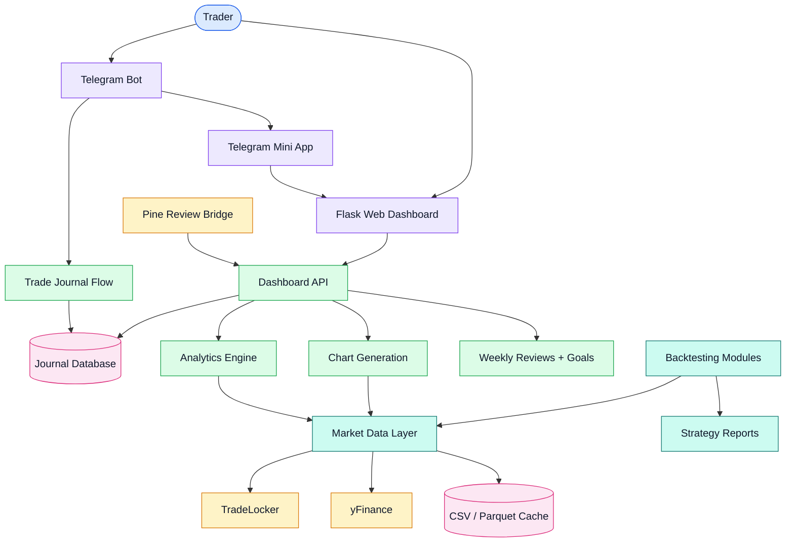

# Lingonberry Journal

[](https://www.python.org/)
[](https://core.telegram.org/bots/api)
[](https://flask.palletsprojects.com/)
[](https://pandas.pydata.org/)
[](https://tradelocker.com/)
[](https://en.wikipedia.org/wiki/Backtesting)

Lingonberry Journal is a trading journal platform with Telegram trade logging, a Flask web dashboard, chart generation, market data integrations, backtesting tools, weekly reviews, and performance analytics.

Demo: [Trading Journal Bot Demo](https://youtu.be/nYDuefVCTns)

## Overview

The project combines day-to-day trade journaling with research tooling. Traders can log trades through Telegram, review performance in a web dashboard, track psychology and process adherence, inspect charts, run backtests, and analyze account progress across personal or prop-firm accounts.

It is designed as a practical trading operations system rather than a simple notebook: trade capture, review, analytics, account rules, market data, and strategy testing live in one repo.

## Features

| Feature | Details |
| --- | --- |
| Telegram trade logging | Guided conversation flow for symbol, direction, entry, SL, TP, notes, mood, and lot size. |
| Telegram Mini App | Opens the web dashboard from Telegram through a public HTTPS URL. |
| Web dashboard | Flask app for trades, accounts, analytics, reviews, goals, and replay views. |
| Multi-account support | Tracks multiple personal or prop-firm accounts and active account selection. |
| Performance analytics | Win rate, expectancy, Sharpe-style metrics, Monte Carlo analysis, and dashboard summaries. |
| Psychology tracking | Captures mood, stress, confidence, notes, and process-review context. |
| Charting | Generates charts with entry, stop-loss, take-profit, and review overlays. |
| Market data | TradeLocker, broker CSV, yFinance, CSV, and Parquet data sources. |
| Backtesting | ICT/SMC and systematic strategy testing for forex, commodities, NAS100, and related markets. |
| Weekly goals | Tracks process adherence, weekly goals, and reviews. |

## System design



### Runtime flow

| Step | Component | Responsibility |
| --- | --- | --- |
| 1 | Telegram bot | Captures trades through a guided logging flow. |
| 2 | Journal database | Stores accounts, trades, reviews, goals, psychology fields, and annotations. |
| 3 | Flask dashboard | Displays trades, analytics, reviews, goals, and account rule progress. |
| 4 | Market data layer | Fetches or caches OHLC data from TradeLocker, yFinance, broker CSV, or local files. |
| 5 | Analytics engine | Computes performance metrics, Monte Carlo output, account progress, and dashboards. |
| 6 | Backtesting modules | Test strategy logic against historical market data. |
| 7 | Mini App / tunnels | Exposes the dashboard through HTTPS for Telegram Web App usage. |

## Tech stack

| Layer | Choice | Notes |
| --- | --- | --- |
| Bot | `python-telegram-bot` | Telegram commands, journaling flow, account selection, Mini App entry. |
| Scheduler | APScheduler | Reminder and scheduled workflow support. |
| Web dashboard | Flask, Flask-CORS, Gunicorn | Local and deployable dashboard/API. |
| Data analysis | pandas, matplotlib, pyarrow | Analytics, charting, caching, and reports. |
| Market data | TradeLocker, yFinance, CSV/Parquet | Live, fallback, and local data sources. |
| Backtesting | Python strategy modules | Forex ICT/SMC and NAS100 strategy testing. |
| Testing | pytest | Test suite through `make test`. |

## Telegram commands

| Command | Purpose |
| --- | --- |
| `/start` | Initialize the bot and show account/dashboard actions. |
| `/journal` | Log a new trade through the guided flow. |
| `/open` | View open trades. |
| `/close [id] [price]` | Close a trade. |
| `/stats` | View performance statistics. |
| `/report` | Open the web dashboard. |
| `/mini` | Open or configure the Telegram Mini App. |
| `/accounts` | List trading accounts. |
| `/useaccount [id]` | Switch the active account. |
| `/newaccount` | Create a new trading account. |
| `/setgoal` | Set weekly process or performance goals. |

## Quick start

Clone the repository:

```bash
git clone https://github.com/brusnyak/lingonberry_journal.git
cd lingonberry_journal
```

Create the environment and install dependencies:

```bash
make install
```

Create a local environment file:

```bash
cp .env.example .env
```

Set the required Telegram values:

```env
TELEGRAM_JOURNAL=your_bot_token_here
TELEGRAM_JOURNAL_CHAT=your_chat_id_here
WEBAPP_URL=http://localhost:5000/mini
WEBAPP_PORT=5000
```

The code also supports the legacy misspelled `TELEGRAM_JOURAL` variable for compatibility, but `TELEGRAM_JOURNAL` is the clearer name to use going forward.

Run the bot and dashboard in separate terminals:

```bash
make run-bot
make run-web
```

Run tests:

```bash
make test
```

## Environment variables

| Variable | Required | Purpose |
| --- | --- | --- |
| `TELEGRAM_JOURNAL` | Yes | Telegram bot token from BotFather. |
| `TELEGRAM_JOURNAL_CHAT` | Yes | Authorized Telegram user or chat ID. |
| `WEBAPP_URL` | Yes for Mini App | Public or local dashboard URL, usually ending in `/mini`. |
| `WEBAPP_PORT` | No | Flask dashboard port, defaulting to `5000`. |
| `PINE_WEBHOOK_SECRET` | Optional | Secret for TradingView/Pine alert ingestion. |
| `FINNHUB_API_KEY` | Optional | Market/news data integration. |
| `NEWSAPI_KEY` | Optional | News integration. |
| `TRADING_ECONOMICS_KEY` | Optional | Macro/economic data integration. |
| `EODHD_API_KEY` | Optional | Market data integration. |
| `ORACLE_VM_IP` | Optional | Deployment target reference. |

## Telegram Mini App setup

Telegram Mini Apps require a public HTTPS URL.

### ngrok

```bash
brew install ngrok
ngrok http 5000
```

Set:

```env
WEBAPP_URL=https://your-url.ngrok.io/mini
```

### Cloudflare Tunnel

```bash
brew install cloudflare/cloudflare/cloudflared
cloudflared tunnel --url http://localhost:5000
```

For production, deploy the web application behind your own HTTPS domain.

## Market data

| Source | Markets | Role |
| --- | --- | --- |
| TradeLocker | Forex and commodities | Primary live market data and quotes. |
| Broker CSV | NAS100 and broker-specific exports | Broker-specific historical data. |
| yFinance | Stocks and crypto | Fallback data source. |
| CSV / Parquet | Any supported market | Local cache and backtesting input. |

## Backtesting

### Forex ICT/SMC

`backtesting/forex_v1.py` implements a multi-timeframe strategy using:

- 4H, 1H, 15m, and 1m structure.
- Liquidity sweeps.
- Market structure shifts.
- Fair-value-gap retests.

### NAS100

`backtesting/nas100_test.py` tests strategy families across timeframes and risk-to-reward settings:

- EMA crossover.
- RSI mean reversion.
- SMA pullback.
- Breakout strategies.

```bash
make nas100
make nas100-sweep
make nas100-monthly
```

## API overview

| Area | Endpoints |
| --- | --- |
| Accounts | `GET /api/accounts`, `POST /api/accounts`, `POST /api/accounts/:id/rules` |
| Trades | `GET /api/trades`, `GET /api/trades/open`, `POST /api/trades/:id/close`, `POST /api/trades/:id/review` |
| Analytics | `GET /api/dashboard`, `GET /api/analytics/monte-carlo`, `GET /api/replay/:id` |
| Weekly reviews | `GET /api/review/week`, `POST /api/review/week`, `GET /api/goals/week`, `POST /api/goals/week` |

## Project structure

```text
lingonberry_journal/
├── backtesting/             # Strategy testing and walk-forward analysis
├── bot/                     # Telegram bot and journal database
├── webapp/                  # Flask dashboard and API
├── infra/                   # Market data and external integrations
├── core/                    # Analytics, export, Monte Carlo, and raw import utilities
├── backtesting_config/      # Account and prop-firm rule templates
├── scripts/                 # Setup and maintenance scripts
├── docs/                    # Additional documentation
├── data/                    # Database, cache, and market data
└── pine-review/             # Market-structure review application
```

## Troubleshooting

| Issue | Checks |
| --- | --- |
| Bot does not respond | Confirm token/chat ID, verify process is running, and inspect bot logs. |
| Charts are not generated | Check market-data credentials, `data/cache/` permissions, and fallback data availability. |
| TradeLocker data does not load | Verify `TL_*` credentials and broker-specific symbol names. |
| Mini App does not open | Confirm `WEBAPP_URL` is public HTTPS and points to a running dashboard. |

## Roadmap

- Connect Pine Review analysis to the main journal.
- Automatically overlay HH, HL, BOS, CHoCH, FVG, and liquidity structures.
- Add real-time WebSocket market streaming for scalping workflows.
- Expand TradeLocker forex-data support.
- Add execution integrations for Binance Futures and Bybit.
- Improve deployment packaging for a persistent Linux VM.

## README style direction

This repository follows the shared portfolio README structure:

- Short product description at the top.
- Technology labels for fast scanning.
- Feature, command, market-data, and API tables.
- Coloured system design diagram when architecture is useful.
- Practical setup, Mini App, testing, troubleshooting, and roadmap sections.

## License

No license file is currently included in this repository.
